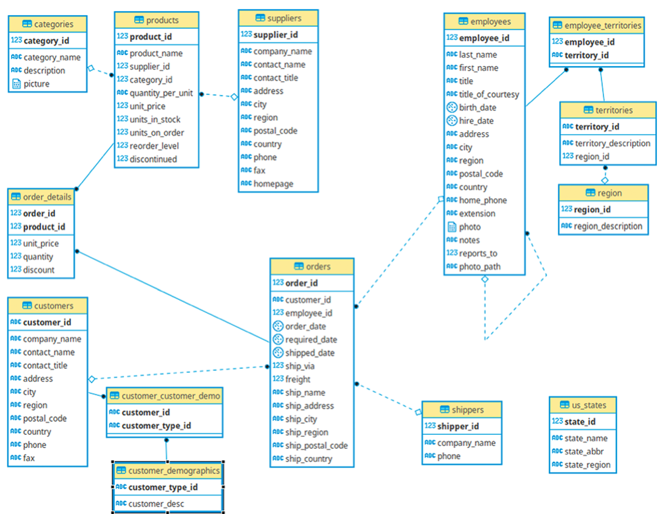

# 📊 Northwind Sales Analytics

<p align="center">


</p>

> A professional **Data Engineering portfolio project** built with **PostgreSQL** using the **Northwind** sample database.

This repository simulates the work of a **Data Engineer** supporting business stakeholders by designing analytical reports, documenting business logic, and transforming raw sales data into meaningful business insights.

---

# 🎯 Project Overview

Business leaders rarely ask for SQL queries.

They ask questions like:

- How is the company performing?
- Which customers generate the most revenue?
- Which products are driving sales?
- Which markets are growing?

The objective of this project is to answer those questions through well-designed SQL reports while following professional software engineering practices.

---

# 💼 Business Objectives

This project is designed to answer questions such as:

- How is the business performing overall?
- Who are our highest-value customers?
- Which products generate the most revenue?
- Which sales representatives perform best?
- Which countries contribute the most sales?
- How efficiently are customer orders being fulfilled?

---

# 🛠 Technology Stack

| Technology | Purpose |
|------------|---------|
| PostgreSQL | Relational Database |
| SQL | Data Analysis & Reporting |
| Git | Version Control |
| GitHub | Portfolio Hosting |
| Cursor | Development Environment |

---

# 🗄 Data Model

The project uses the **Northwind** sample database.

The following Entity Relationship Diagram illustrates the core tables used throughout the project.



---

# 📁 Repository Structure

```text
northwind-sales-analytics/
│
├── README.md
├── .gitignore
│
├── docs/
│
├── images/
│   ├── northwind_erd.png
│   └── sales_overview.png
│
├── insights/
│   └── sales_overview.md
│
└── sql/
    └── 01_sales_overview.sql
```

| Folder | Purpose |
|---------|---------|
| **sql/** | Production-ready SQL reports |
| **insights/** | Business explanations and analytical conclusions |
| **images/** | Screenshots, ER diagrams, and project visuals |
| **docs/** | Supporting documentation |

---

# 📊 Analytics Deliverables

| Report | Business Question | Status |
|--------|-------------------|:------:|
| Executive Sales Overview | How is the company performing overall? | ✅ |
| Customer Segmentation | Who are our most valuable customers? | ⏳ |
| Product Performance | Which products drive the most revenue? | ⏳ |
| Employee Performance | Which sales representatives perform best? | ⏳ |
| Country Sales Analysis | Which markets generate the most revenue? | ⏳ |
| Shipping Analysis | How efficient is the shipping process? | ⏳ |
| Executive Dashboard | Executive KPI Summary | ⏳ |

---

# 🔄 Project Workflow

```text
Business Question
        │
        ▼
Report Design
        │
        ▼
SQL Development
        │
        ▼
Business Validation
        │
        ▼
Business Insights
        │
        ▼
GitHub Documentation
```

This workflow reflects how analytical reporting is commonly developed in professional Data Engineering and Analytics teams.

---

# 📈 Featured Report

## Executive Sales Overview

### Business Question

> How is the company performing overall?

### Report Grain

One row representing the overall sales performance of the business.

### Key Performance Indicators

- Total Revenue
- Total Orders
- Total Customers
- Average Order Value

### SQL Concepts

- Aggregate Functions
- INNER JOIN
- Common Table Expressions (CTEs)
- COUNT(DISTINCT)
- NULLIF()

### Report Preview


---

# 🧠 Skills Demonstrated

### SQL

- Aggregate Functions
- INNER JOIN
- Common Table Expressions (CTEs)
- COUNT(DISTINCT)
- Query Optimization
- SQL Documentation

### Analytics

- KPI Design
- Business Metrics
- Report Grain
- Executive Reporting
- Business Analysis

### Software Engineering

- Git Version Control
- GitHub Workflow
- Documentation
- Repository Organization
- Professional SQL Formatting

---

# 🗺 Project Roadmap

| Milestone | Status |
|-----------|:------:|
| Repository Setup | ✅ |
| Executive Sales Overview | ✅ |
| Customer Segmentation | 🔄 In Progress |
| Product Performance | ⏳ |
| Employee Performance | ⏳ |
| Country Sales Analysis | ⏳ |
| Shipping Analysis | ⏳ |
| Executive Dashboard | ⏳ |

---

# 🚀 Future Improvements

Planned enhancements include:

- SQL Views
- Performance Optimization
- Index Analysis
- Dashboard Visualizations
- Data Quality Validation
- Automated Reporting
- Python ETL Pipelines

---

# 👨‍💻 About the Author

**Camilo Patiño**

Aspiring **Data Engineer** focused on building production-quality analytics projects that combine SQL, business thinking, documentation, and software engineering best practices.

📫 GitHub: https://github.com/campa-dev

---

⭐ If you found this project interesting, feel free to explore the reports and follow its progress as new analytical deliverables are added.
